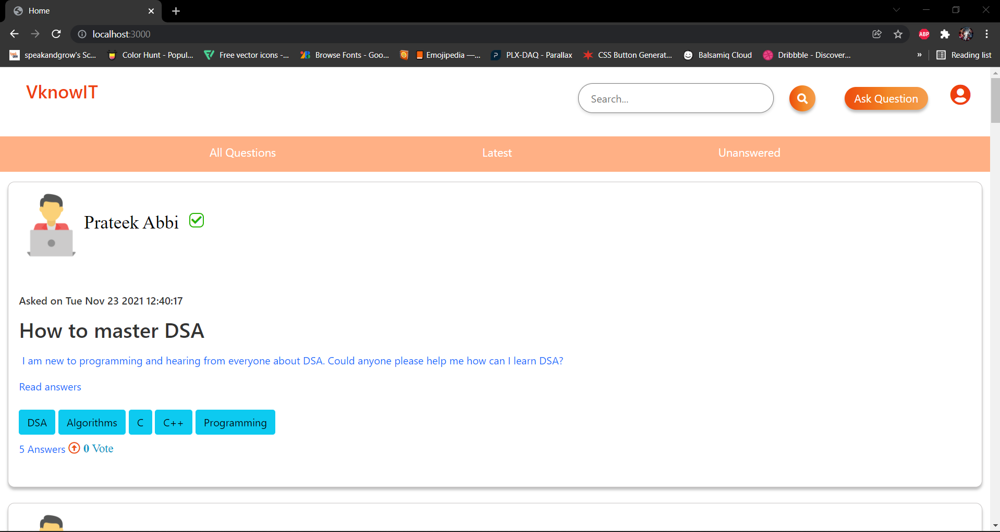
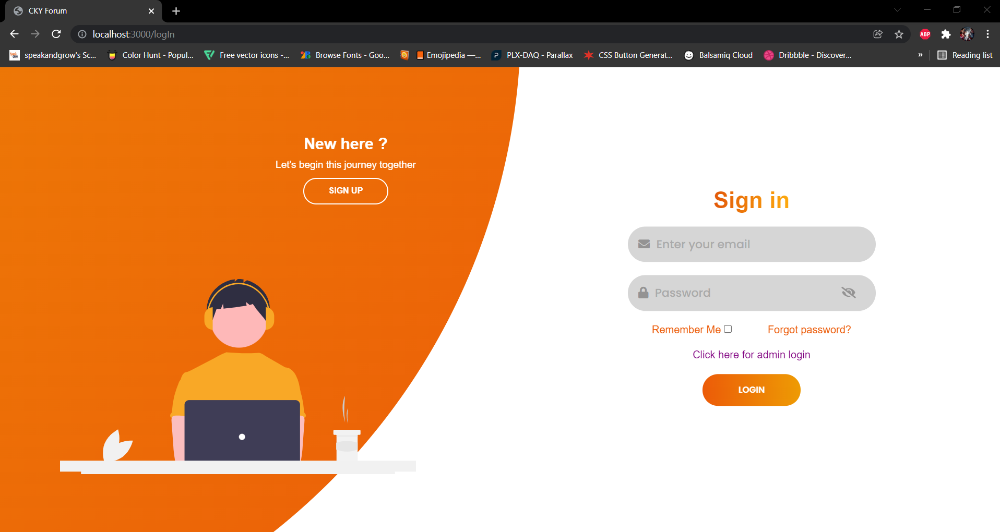
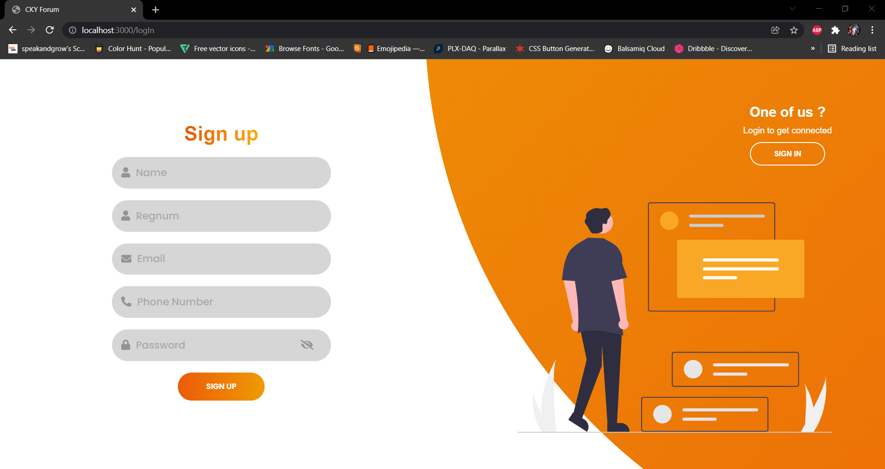
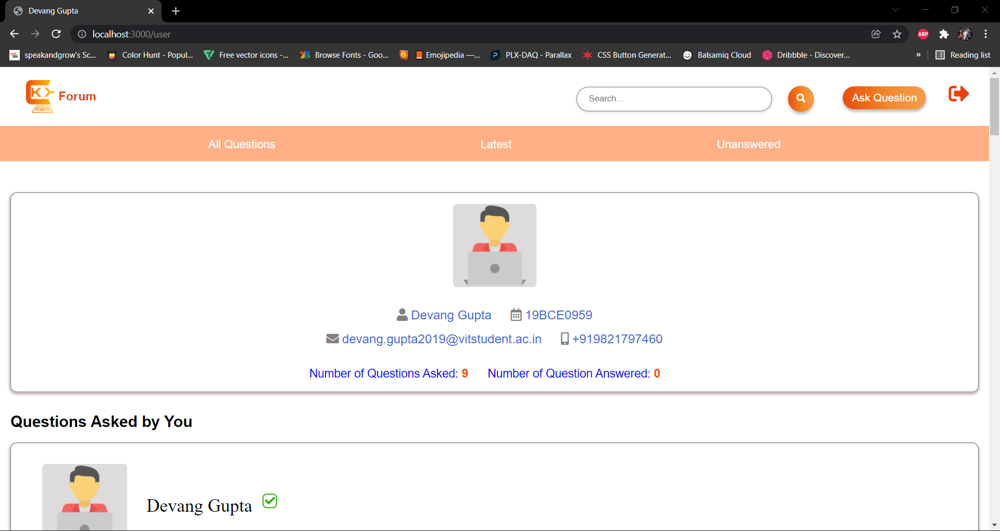
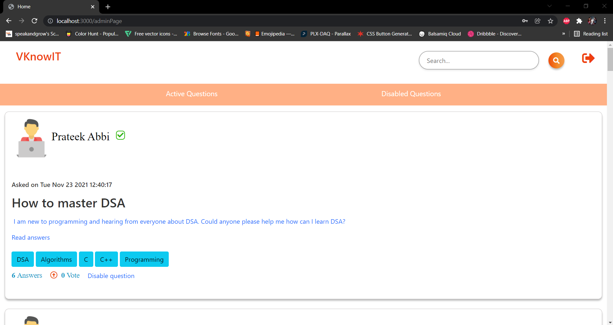
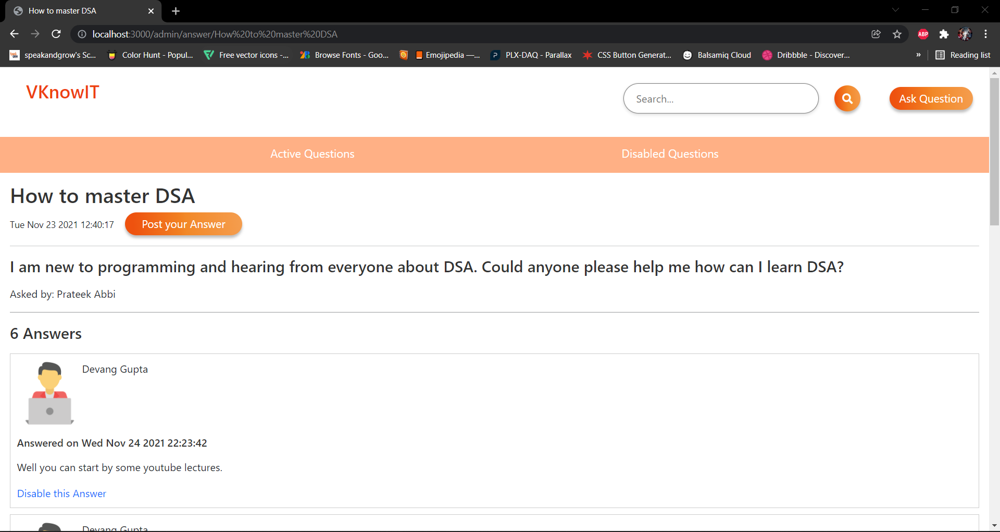

# Abstract💡

The aim of our project is to create a student portal which works as an interface and used to associate with the students in a university. Here the portal is basically classified into two categories such as Registration Desk and Community Portal . Here the application permits the enrolled user to login and new user is allowed to enroll. Student community portal contains forums including Event queries , Placement queries , Sports queries , Freshers queries etc.

# Problem Statement📘

When it comes to college there are freshers that are concerned about the event's queries, placement's queries , faculty reviews , holidays and queries about their courses etc. Our website will help these type of students to interact with other students to help solve their queries. More functionalities and features will be added to make it easier and convenience for students to get their question answered. This website can be one stop solution to all the problems of the students.

# Reason To Choose this topic📈

* The major reason behind choosing this topicis to help students who are shy asking their queries in person can ask their queries here regarding different events in the college and interact with the seniors to make connection and all in the college.
* The another reason for choosing this topic is to provide ease to the students, with this they can know the college and the other students.
* Providing interactive and improved user interface can help the student to use our website more effectively for their own benefits.

# Dependencies Used 📚
    "alert": "^5.0.10",
    "body-parser": "^1.19.0",
    "cookie-parser": "^1.4.5",
    "crypto": "^1.0.1",
    "ejs": "^3.1.6",
    "express": "^4.17.1",
    "express-session": "^1.17.2",
    "fs": "0.0.1-security",
    "gridfs-stream": "^1.1.1",
    "lodash": "^4.17.21",
    "luxon": "^2.1.1",
    "moment-timezone": "^0.5.34",
    "mongoose": "^6.0.9",
    "multer": "^1.4.3",
    "multer-gridfs-storage": "^5.0.2",
    "nodemailer": "^6.7.0",
    "passport": "^0.5.0",
    "passport-local-mongoose": "^6.1.0",
    "path": "^0.12.7",
    "popups": "^1.1.3"

# API Used📦

* Ckeditor Api

# Standards Followed✅

* Global variables have a limited use
* Standard headers for different modules have been mentioned
* All naming conventions for local, global variables have been followed
* Functions, dependencies and libraries have been clearly stated and named
* Proper indentation has been followed throughout the codes
* Exception and error handling measures have been taken for backend and frontend codes
* No identifier has a multiple usage
* GOTO statements are not used
* Codes are well documented
* High congestion, low coupling used
* Modularity maintained by reusing functions to create multiple cards and info pages.

# How to Use🤝

1. Run the clone command to download the repository into your local directory.
```
$ git clone https://github.com/Devang-exe/SoftwareModellingTool.git
```
2. Open the project with any IDE that supports Java gui for e.g VsCode
3. Run the project using npm install and then nodemon app.js.
4. Make sure Node Js and MongoDB is installed in your machines.

## Images
### Home Page

### SignIn Page

### SignUp Page

### User Page

### Admin Page



# Conclusion💥

So, as you can see, we have successfully implemented a simple student community portal (VknowIT) using HTML CSS JavaScript Node Js and MongoDB. This website is easy to use and user friendly and made for students. This website can be extended with the real time chat application integrated with this website, with which they can chat with each other in groups

# REFERENCES
Stack Overflow https://stackoverflow.com/

Quora https://www.quora.com/

Brainly https://brainly.in/

YouTube https://www.youtube.com/


 
